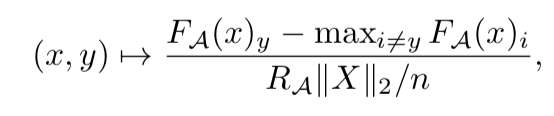

A visualization of a statement in "[Spectrally-normalized margin bounds for
neural networks]".

In section 2, they mention a useful metric for the difficulty of a dataset,

The distribution of this over the training set somehow captures the difficulty
of a dataset.

This is a visualization of that quantity with MNIST and FashionMNIST. I only
change which dataset is being used.

[Spectrally-normalized margin bounds for neural networks]:https://arxiv.org/pdf/1706.08498.pdf
